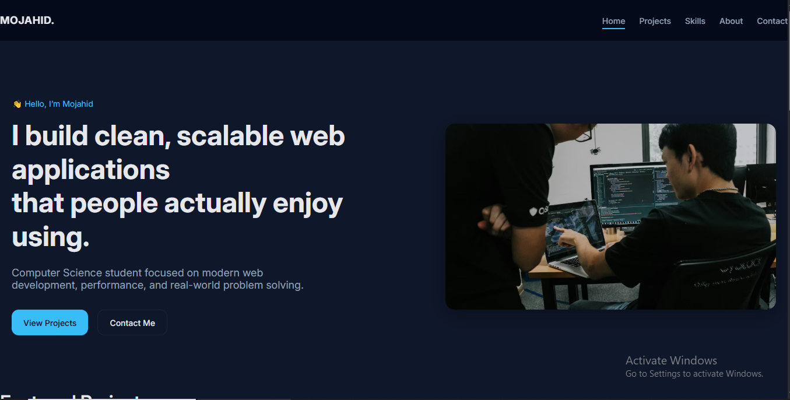

# Mojahid — Personal Portfolio Website

This repository contains the source code for my personal portfolio website.

The website is built to present my projects, skills, and background as a Computer Science student in a clean, professional, and responsive format. The focus is on clarity, usability, and modern frontend practices rather than visual gimmicks.

This portfolio is intended for internships, opportunities, and showcasing real development work.

---

## 🌐 Live Website

🔗 https://mojahid-portfolio.vercel.app


---

## 📸 Preview

Below is a preview of the website interface.




---

## ✨ Features

- Fully responsive design (desktop, tablet, and mobile)
- Clean and minimal UI with consistent spacing
- Mobile navigation with hamburger menu
- Projects section highlighting real work and tech stack
- Skills section grouped by categories
- About section with personal background
- Contact section with direct email and social links
- Sticky navigation bar
- Smooth scrolling and readable typography
- Lightweight and fast (no frameworks)

---

## 🛠️ Built With

- **HTML5** — semantic and structured markup
- **CSS3** — custom design system using CSS variables
- **JavaScript** — minimal scripting for mobile navigation
- **Vercel** — hosting and deployment

---


## 📁 Project Structure

```text
├── index.html
├── style.css
├── assets/
│   ├── images/
│   │   ├── hero.jpg
│   │   ├── preview.png
│   │   ├── expense-tracker.jpg
│   │   ├── portfolio.jpg
│   │   └── taskmanagement.jpg
│   └── icons/
```

## 📌 Purpose of This Project

This project was created to serve as my personal portfolio website.  
Its purpose is to showcase my projects, technical skills, and approach to building web applications in a clear and professional manner.

The portfolio reflects my focus on:
- Writing clean and readable code
- Building responsive and user-friendly interfaces
- Applying modern frontend development practices
- Presenting work in a simple, honest, and effective way

It is intended for internships, entry-level opportunities, and as a public demonstration of my development work.

---


## 👤 Author

**Mojahid**  
Computer Science Student  

- GitHub: https://github.com/mojahid-dev  
- LinkedIn: https://linkedin.com/in/mojahid-ui-135aa2398  
- Email: mojahid.dev.sihf@gmail.com  

---

## 📄 License

This project is licensed under the **MIT License**.

You are free to use, modify, and distribute the code for personal or educational purposes.  
However, the content, layout, and branding of this portfolio should not be copied directly without permission.

---

## ⭐ Acknowledgements

This project was built using modern web standards and is inspired by clean design principles commonly used in professional developer portfolios.

Thanks to the open-source community and web documentation resources that make learning and building accessible for everyone.


